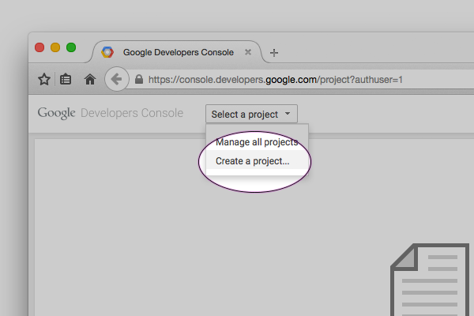
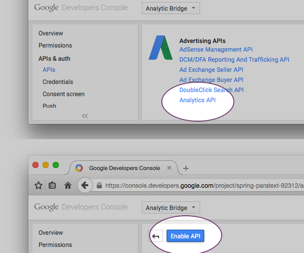
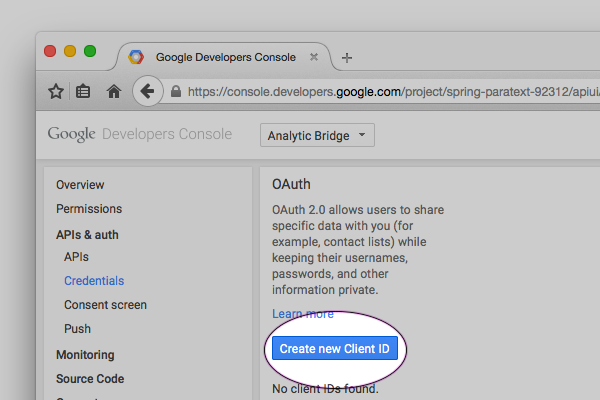
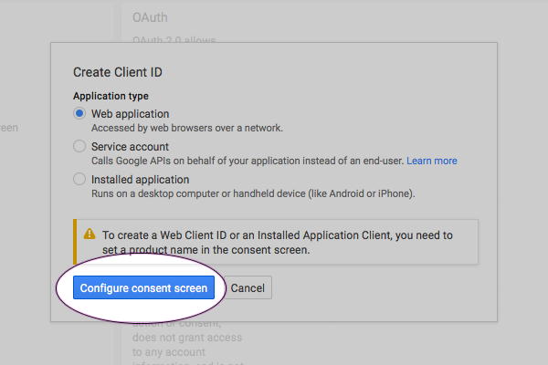
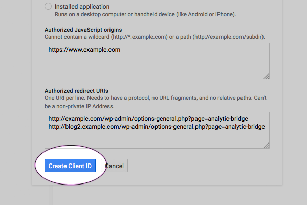
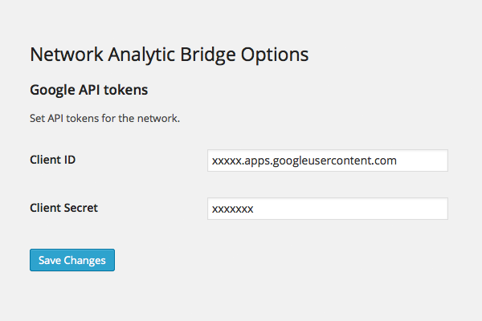

# Setup

There are three steps for setting up the Analytic Bridge plugin.

 1. Create a Google Developer project
 2. Connect the Analytic Bridge to Google's APIs
 3. Connecting a Google Analytics Profile

Networks only need to complete step 1 and 2 once. Each blog on the network must
complete step 3.

---

### 1. Create a Google Developer project

To allow Google to monitor usage on its API, every call must be authenticated with a Client Secret and Client ID. No special account is necessary for this.

Log into [console.developers.google.com/](https://console.developers.google.com/) and create a new project for the plugin. Name the project something like "Analytic Bridge."

Under APIs & auth, click "APIs". Find the Analytics API and enable it.

Under APIs & auth, click "Credentials." From here click "Create new Client ID."

Use "Web application" for the Application type, and click "Configure Consent Screen".

Enter a product name and other optional pieces of the consent screen. No need for advanced configuration — only one user will ever authenticate the app per site.

When you're done, save consent screen options.

On the next screen, enter an "Authorized redirect URIs" in the format: 

	http://your-domain.com/wp-admin/options-general.php?page=analytic-bridge

If you're installing the Analytic Bridge on a network of sites, every subdomain and custom URL on the network must be defined on additional lines.

Google should provide a Client ID and Client Secret on the next screen. Save these around for the next step.

---

### 2. Connect the Analytic Bridge to Google's API

Depending on whether your blog is a network or single site, input the Client Secret and Client ID on the appropriate options page.

__Network__

If you are the Site Administor of a network, paste the values from step one into the __Network__ Options page for the Analytic Bridge.

__Single Site__

If you do not have a WordPress network install (or are not an administor of your network), enter the values from step one on the options page for the Analytic Bridge (Settings > Analytic Bridge).

---

### 3.  Connecting a Google Profile

 * [Find the profile id](https://support.google.com/analytics/answer/1032385?hl=en-GB) that corresponds to the Google Analytics table tracking your site, and save it in Property View ID. This should be in the format `ga:xxxxxxx`

 * Assuming steps one and two are valid a "connect" link should become available at the bottom of the page. Use this button to authorize a Google account with permissions to the Property View you are attempting to pull data from.