# Setup

There are three steps for setting up the Google Analytics Popular Posts plugin.

 1. Create a Google Developer project
 2. Connect the Google Analytics Popular Posts plugin to Google's APIs
 3. Connecting a Google Analytics Profile

Networks only need to complete step 1 and 2 once. Each blog on the network must
complete step 3.

---

### 1. Create a Google Developer project

To allow Google to monitor usage on its API, every call must be authenticated with a Client Secret and Client ID. No special account is necessary for this.

Log into [console.developers.google.com/](https://console.developers.google.com/) and create a new project for the plugin. 

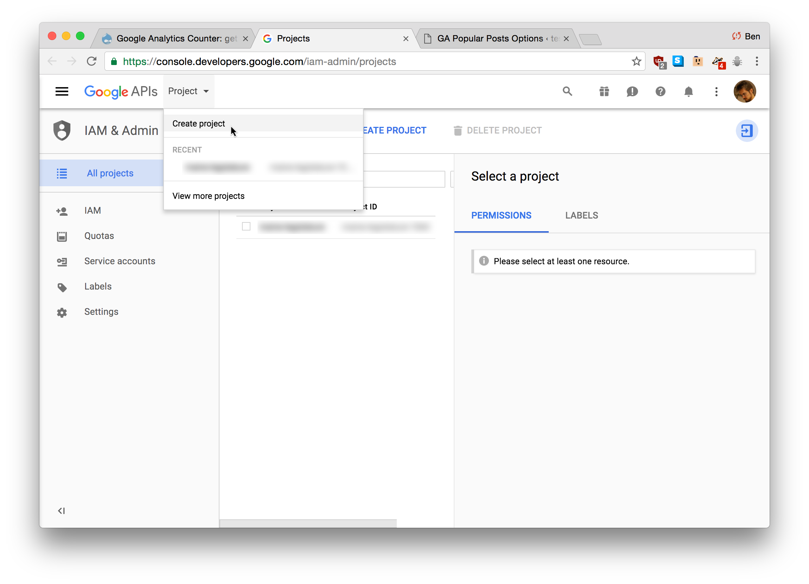

Name the project something like "Google Analytics Popular Posts."

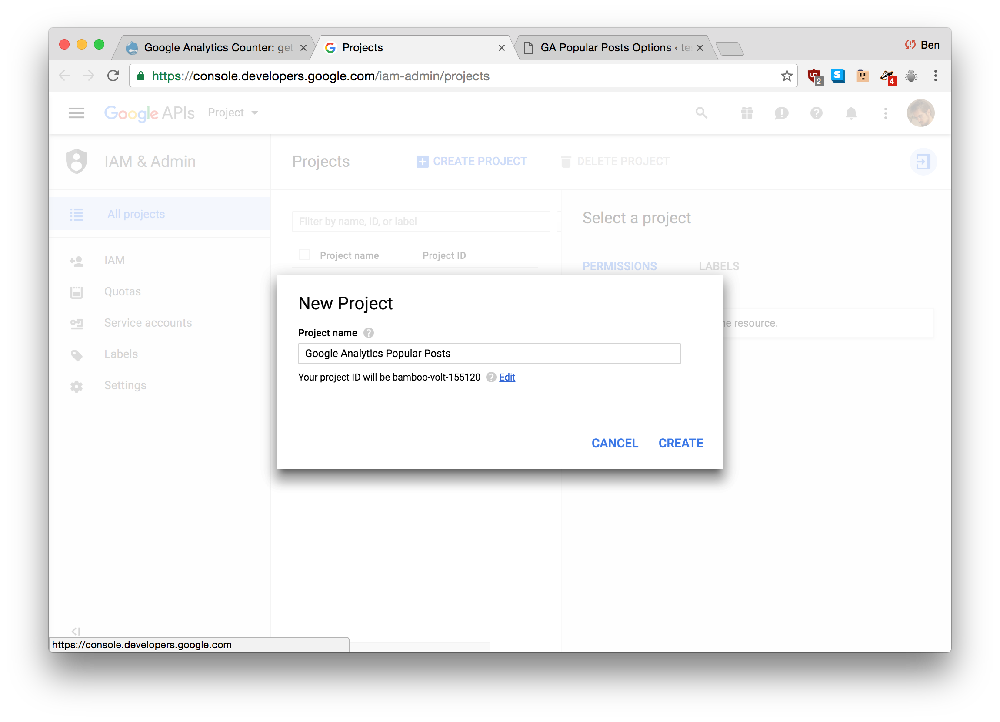

You'll see a list of available Google APIs. Find the **Analytics API** link:

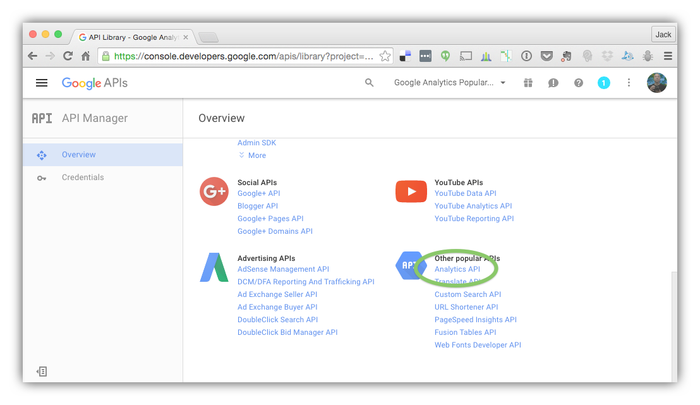

Click the **Analytics API** link and then click the button to enable it on the next screen:

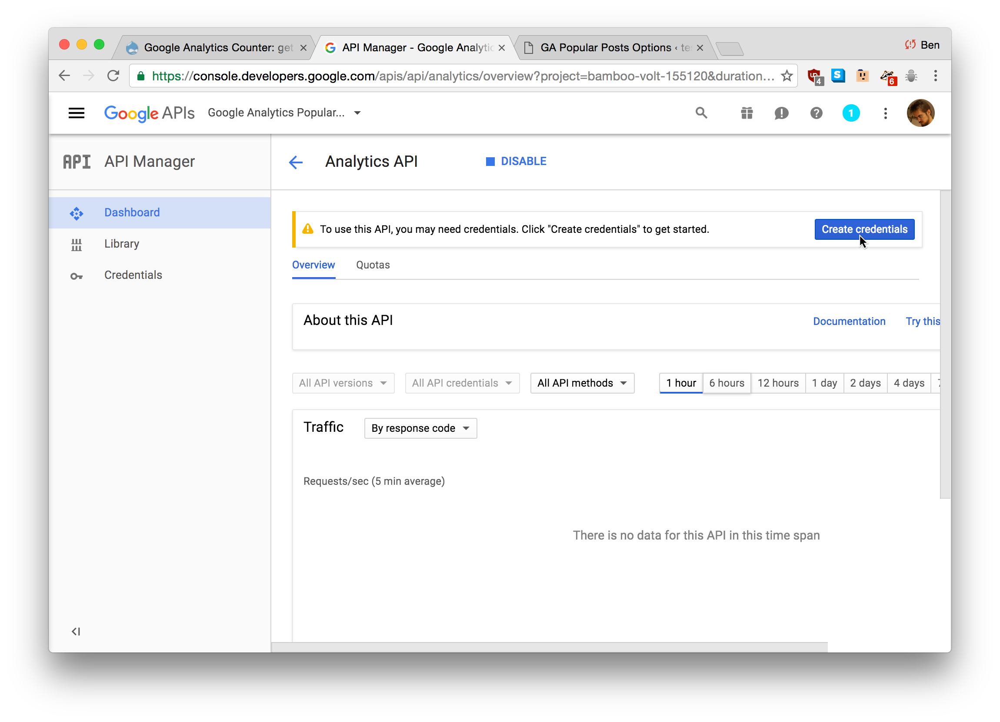

Before you can use the API you'll need to create credentials for it so click the **Go to Credentials** button to open the Credentials Wizard:

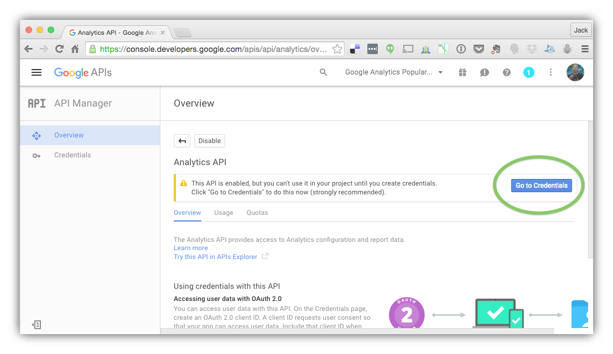

You're now in the credentials wizard but you can skip it and just click the "client ID" link:

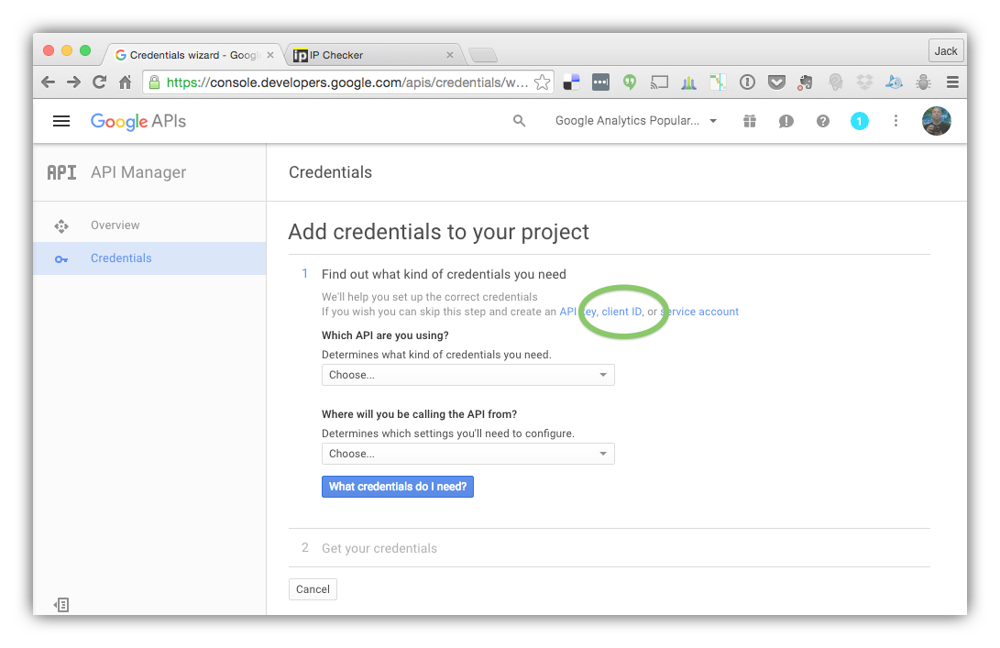

On the next screen just click the "Configure Consent Screen" button:

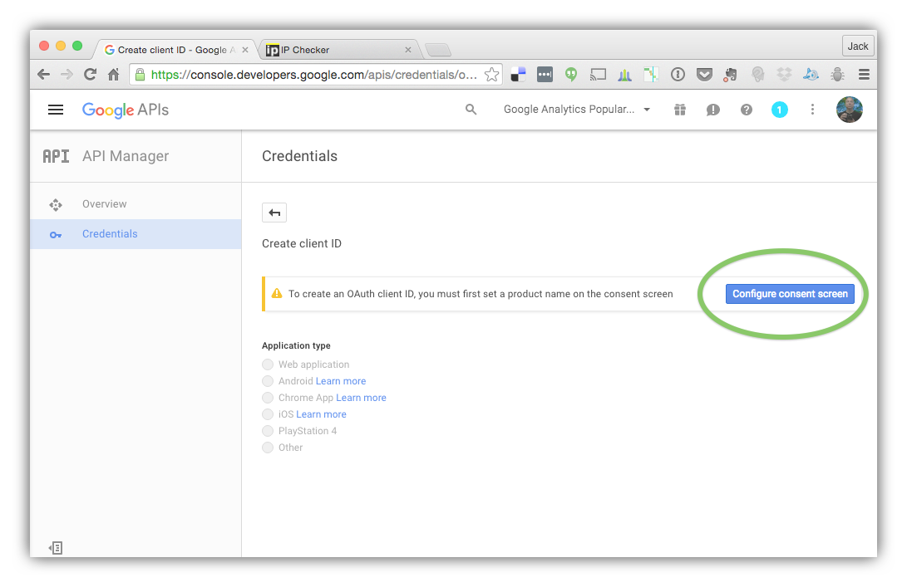

Enter a product name and, if you wish, other optional pieces of the consent screen. Only the "Product name shown to users" field is required.

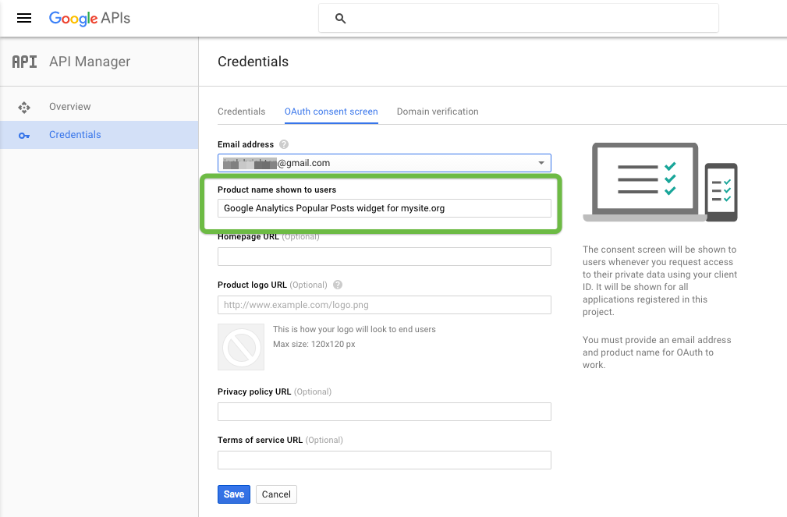

When you're done, save consent screen options.

On the next screen, select "Web application" as the Application type, then enter an "Authorized redirect URIs" in the format: 

	http://your-domain.com/wp-admin/options-general.php?page=analytic-bridge

If you're installing the Google Analytics Popular Posts on a network of sites, every subdomain and custom URL on the network must be defined on additional lines.

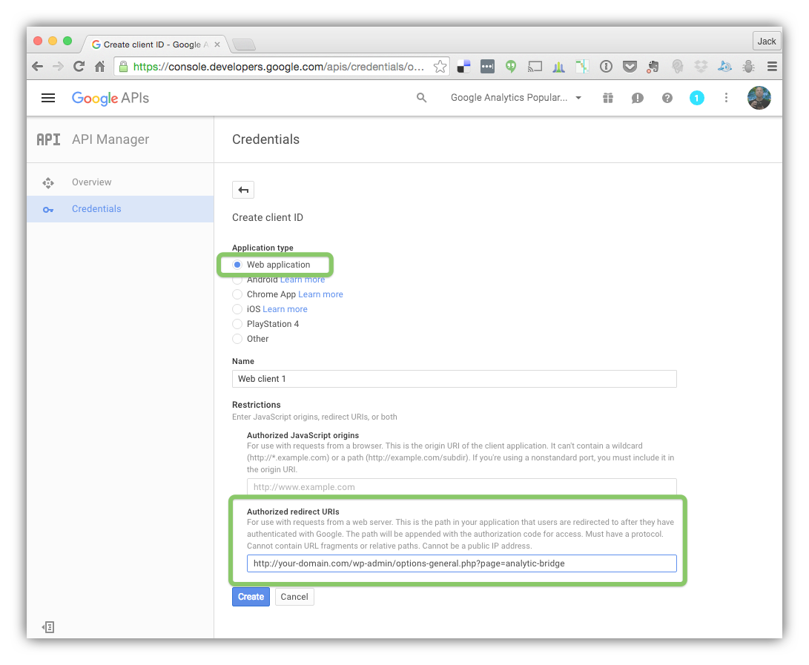

Google should provide a Client ID and Client Secret on the next screen:

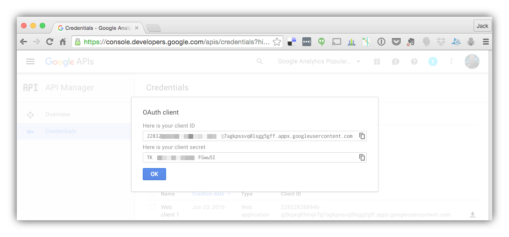

Copy these keys and keep them safe for the next step.

---

### 2. Connect the Google Analytics Popular Posts plugin to Google's API

Now it's back to the WordPress dashboard to connect to the Analytics API with your keys and Property ID. Go to **Settings > GA Popular Posts**.

Depending on whether your blog is a network or single site, input the Client Secret and Client ID on the appropriate options page.

 > ___For Networks:___ If you are the Site Administor of a network, paste the values from step one into the Network Options page for the Google Analytics Popular Posts.

or:

 > ___For Single Sites:___ If you do not have a WordPress network install (or are not an administor of your network), enter the values from step one on the options page for the Google Analytics Popular Posts (Settings > Google Analytics Popular Posts).

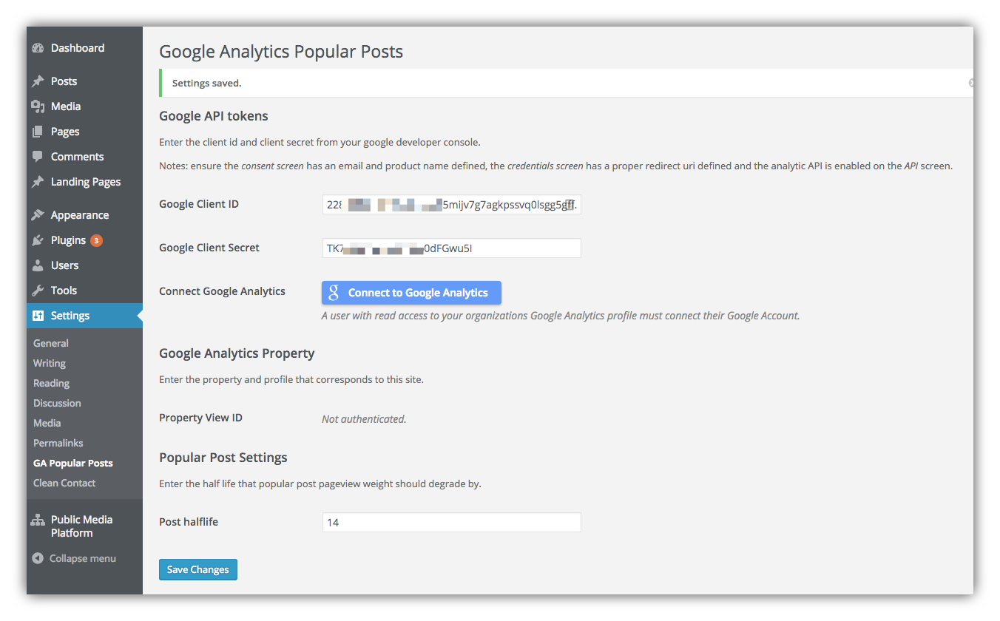

Click the "Connect to Google Analytics" button and select a Google account to be associated with this application. After connecting the Google account you'll return to the Settings screen, where you'll enter the Google Profile ID for the website.

---

### 3.  Connecting a Google Profile

 * [Find the profile id](https://support.google.com/analytics/answer/1032385?hl=en-GB) that corresponds to the Google Analytics table tracking your site, and save it in Property View ID. This should be in the format `ga:xxxxxxx`

 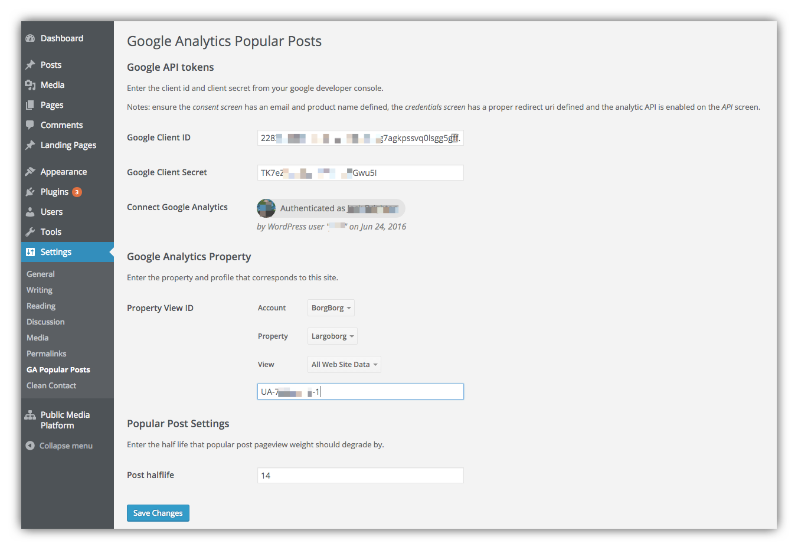

 

 * Assuming steps one and two are valid a "connect" link should become available at the bottom of the page. Use this button to authorize a Google account with permissions to the Property View you are attempting to pull data from.