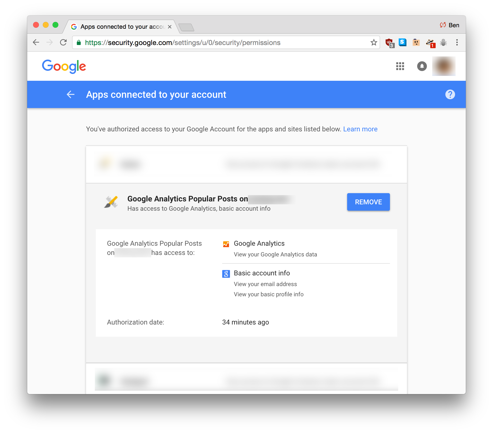

# Troubleshooting

This is going to be a list of common errors encountered when seting up the plugin.

If you experience a problem not on this list, [please let us know by filing an issue on GitHub](https://github.com/INN/Google-Analytics-Popular-Posts/issues) or by emailing us at nerds@inn.org. Thanks!

## Fatal error: Uncaught Google_Auth_Exception: Error fetching OAuth2 access token, message: 'invalid_grant'

This is usually because you are attempting to connect the plugin to Google Analytics using a Client ID and Client Secret that are already registered with, and have permissions from, your Google account.

There are two ways to fix this:

- Go through the [setup instructions](./setup.md), creating a new Client ID and Client Secret, or
- In your Google Account settings, [find the application you created](https://support.google.com/accounts/answer/3466521?hl=en) and remove its permission to use your Google Account. before going back through the [setup instructions].



In either case, you will need to reset your plugin's settings in the database. See below.

## How to reset your plugin's settings in the database.

Only administrators with access to the site's database can perform this task. If you do not have access to your site's database, please talk to your site administrator about performing this action.

1. **Take a backup of your site.**
2. In the `wp_options` or `wp_#_options` table, delete all rows with an `option_name` starting with `"analyticbridge_"`. As an SQL statement, that's ```delete from wp_options where `option_name` LIKE 'analyticbridge_%';``` *assuming* that your blog is using the `wp_options` table.
