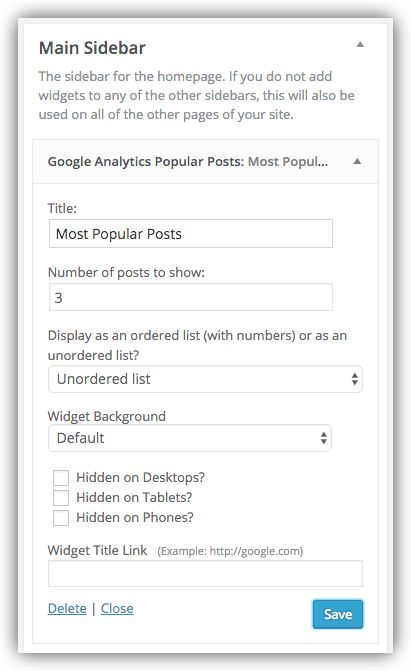

# Google Analytics Popular Posts Widget

Now that you have things set up to connect to Google Analytics, you can begin using the Google Analytics Popular Posts widget to display popular posts in a sidebar or other widget area. The widget will display a set number of headlines of the most popular posts as either an ordered list (numbered) or an unordered list (just the headlines with no numbers). 

## Configure the GA Popular Posts widget

Go to **Appearance > Widgets** and you'll see a widget named Google Analytics Popular Posts. Add it to a sidebar or other widget area and configure the settings as desired:

Options include:

- changing the title (defaults to Recent Posts)
- displaying popular post headlines as either ordered or unordered lists
- changing the number of posts to show
- changing the widget background
- hiding the widget on phones, tablets, or desktops
- adding a link to the title

## Widget on the Front End

Here's the Google Analytics Popular Posts widget displayed in a sidebar, set to show three posts as an unordered list:

